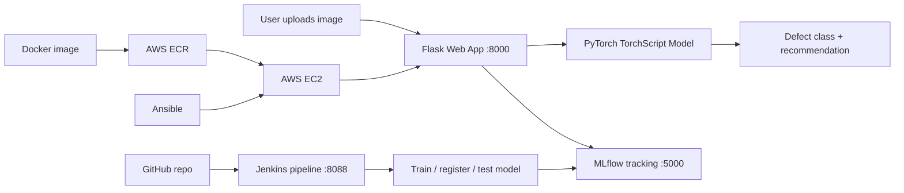

# Architecture & Workflow

## System overview

Full DevOps/MLOps pipeline for solar panel defect detection: ML inference, experiment tracking, CI/CD, containerization, and AWS deployment planning.

## End-to-end workflow



## 1. Architecture & tool integration

| Tool | Role | Your setup |
|------|------|------------|
| **GitHub** | Source control; Jenkins pulls code | Remote repository |
| **Jenkins** | CI/CD pipeline (checkout → test → MLflow → report) | `D:\Jenkins`, port **8088** |
| **MLflow** | Experiment tracking, model registry, prediction logs | `D:/mlflow/`, port **5000** |
| **Flask** | Web UI + `/predict` API for image analysis | `web_app.py`, port **8000** |
| **Docker** | Containerize app for portable deployment | `Dockerfile`, `docker-compose.yml` |
| **AWS** | Production hosting (EC2, ECR, S3) | See `docs/aws-deployment.md` |
| **Ansible** | Automated EC2 provisioning and deployment | `ansible/deploy.yml` |

## 2. DevOps tool installation (D: drive only)

All local tools and data live on **D:** to avoid filling C:.

| Component | Install location | Start command |
|-----------|------------------|---------------|
| Jenkins | `D:\Jenkins` | `java -jar jenkins.war --httpPort=8088` |
| MLflow DB + artifacts | `D:\mlflow\` | See Terminal 2 below |
| Python venv | Project `.venv` on D: | `.\scripts\setup_venv.ps1` |
| Pip cache / temp | `D:\pip-cache`, `D:\temp` | Set automatically by setup scripts |

### Your three terminals (unchanged)

```powershell
# Terminal 1: Jenkins (PORT 8088)
cd D:\Jenkins
java -jar jenkins.war --httpPort=8088

# Terminal 2: MLflow (PORT 5000)
mlflow server --backend-store-uri sqlite:///D:/mlflow/mlflow.db --default-artifact-root file:///D:/mlflow/artifacts --host 127.0.0.1 --port 5000

# Terminal 3: Web App (PORT 8000)
cd "D:\Engineering\6th sem\DevOps\solar-panel-devops"
python web_app.py
```

Optional faster web app start (uses project `.venv`, disables slow MLflow per-request logging):

```powershell
.\scripts\start_web_app.ps1
```

## 3. Jenkins pipeline

**File:** `Jenkinsfile` — 8 stages:

1. Code Checkout (GitHub)
2. Setup Python
3. Verify Model & MLflow
4. Setup MLflow Experiment
5. Log Training to MLflow
6. Register Model in MLflow
7. Run Prediction Tests (6 defect types)
8. Generate Report

**Requires:** MLflow already running on `http://127.0.0.1:5000` before triggering the build.

## 4. Containerization

| File | Purpose |
|------|---------|
| `Dockerfile` | Flask app + model (port 8000) |
| `docker-compose.yml` | App + MLflow server together |
| `docker/Dockerfile` | Alternate FastAPI + MLflow bundle |

```bash
docker build -t solar-panel-devops .
docker run -p 8000:8000 -v ./models:/app/models solar-panel-devops
# or
docker compose up -d
```

## 5. AWS deployment planning

See **`docs/aws-deployment.md`** for:

- Service selection (EC2, ECR, S3, IAM, Security Groups)
- Step-by-step deploy guide
- Ansible automation via `ansible/deploy.yml`

## Request flow (localhost testing)

1. User opens `http://127.0.0.1:8000` and uploads a solar panel image.
2. Browser compresses large images client-side (canvas resize) before upload.
3. Flask receives image at `POST /predict`.
4. Server downscales to max 512px edge, then resizes to 224×224 for the model.
5. TorchScript model returns one of six classes.
6. Response includes model time (`inference_ms`) and total time (`total_ms`).
7. MLflow logging runs in a **background thread** only when `MLFLOW_LOG_PREDICTIONS=true`.

## Performance — why analysis was slow & fixes

| Cause | Fix |
|-------|-----|
| PyTorch import blocks startup (slow on low C: disk) | Model loads in **background thread**; UI opens immediately |
| C: temp/cache during ML load | Auto-redirect to `D:\temp`, `D:\torch-cache`, `D:\pip-cache` |
| Synchronous MLflow HTTP per prediction | Background thread; default `MLFLOW_LOG_PREDICTIONS=false` |
| Large camera/phone photos (5–15 MB) | Client compress (768px) + server thumbnail (384px) |
| Cold-start inference | Model warm-up after load |
| Flask debug reloader | `FLASK_DEBUG=false` default |
| Full CUDA PyTorch on CPU laptop | Use CPU wheel: `--index-url https://download.pytorch.org/whl/cpu` |

**Expected times after fixes:** model ~50–300 ms on CPU once loaded; first model load may take 30–90 s on a tight disk.

**Fastest local test:**

```powershell
$env:MLFLOW_LOG_PREDICTIONS = "false"
python web_app.py
```
