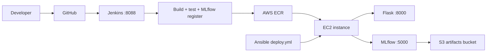

# AWS Deployment Strategy

## Service selection

| AWS Service | Purpose | Why this choice |
|-------------|---------|-----------------|
| **EC2** (`t3.medium`) | Host Flask app + MLflow | Full control, matches local Docker setup, low cost for demos |
| **ECR** | Store Docker images | Native integration with EC2/Docker; versioned image tags per Jenkins build |
| **S3** | MLflow artifacts + model backups | Durable, cheap storage; replaces local `D:/mlflow/artifacts` in production |
| **Security Group** | Network access | Allow 22 (SSH), 8000 (app), 5000 (MLflow UI — restrict in prod) |
| **IAM Role** | EC2 → ECR/S3 access | No hard-coded AWS keys on the instance |

Optional later: **ALB** (HTTPS + path routing), **RDS** (MLflow metadata DB at scale), **CloudWatch** (logs/metrics).

## Architecture (production)



## Deployment steps

### 1. Create AWS resources

```bash
# S3 bucket for MLflow artifacts
aws s3 mb s3://solar-panel-mlflow-artifacts-YOUR_NAME

# ECR repository
aws ecr create-repository --repository-name solar-panel-devops
```

### 2. Build and push Docker image

```bash
cd "D:\Engineering\6th sem\DevOps\solar-panel-devops"
docker build -t solar-panel-devops .
aws ecr get-login-password --region YOUR_REGION | docker login --username AWS --password-stdin YOUR_ACCOUNT.dkr.ecr.YOUR_REGION.amazonaws.com
docker tag solar-panel-devops:latest YOUR_ACCOUNT.dkr.ecr.YOUR_REGION.amazonaws.com/solar-panel-devops:latest
docker push YOUR_ACCOUNT.dkr.ecr.YOUR_REGION.amazonaws.com/solar-panel-devops:latest
```

### 3. Launch EC2

- AMI: Ubuntu 22.04 LTS
- Instance: `t3.medium` (2 vCPU, 4 GB RAM — enough for CPU inference)
- Storage: 20 GB gp3 on EBS (not C: on your laptop)
- Security group: inbound TCP 22, 8000, 5000 from your IP
- Attach IAM role with `AmazonEC2ContainerRegistryReadOnly` + S3 write to artifact bucket

### 4. Deploy with Ansible

Edit `ansible/inventory.ini` with your EC2 public IP and ECR image URI, then:

```bash
ansible-playbook -i ansible/inventory.ini ansible/deploy.yml
```

### 5. Verify

- App: `http://EC2_PUBLIC_IP:8000`
- Health: `http://EC2_PUBLIC_IP:8000/health`
- MLflow: `http://EC2_PUBLIC_IP:5000`

## Environment variables (production)

| Variable | Value |
|----------|-------|
| `MLFLOW_TRACKING_URI` | `http://127.0.0.1:5000` (on same EC2) or remote MLflow URL |
| `MLFLOW_LOG_PREDICTIONS` | `true` in production |
| `MODEL_PATH` | `/app/models/solar_panel_android.pt` (inside container) |
| `FLASK_DEBUG` | `false` |

## Cost estimate (demo / academic project)

- EC2 t3.medium: ~$30/month (stop instance when not demoing)
- ECR: ~$0.10/GB/month
- S3: pennies for artifact storage

## Rollback strategy

1. Tag each ECR push with Jenkins build number: `solar-panel-devops:build-42`
2. Ansible `docker pull` specific tag
3. `docker compose up -d` restarts with previous image
